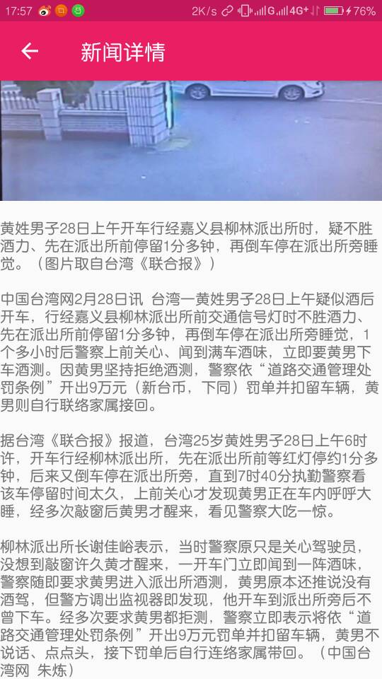
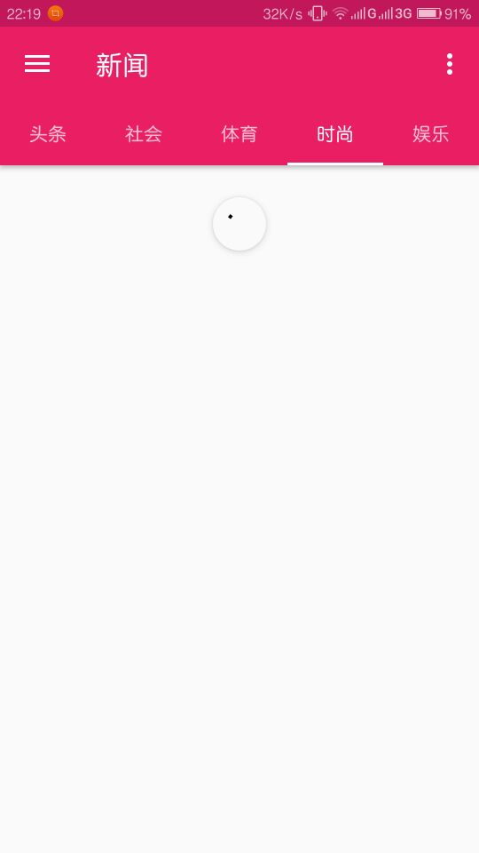

# iNews
#### 简单的基于MVP架构的Android新闻客户端
for my practice with MVP architecture in Android which uses Volley for network request.
## screen shot

## todo
keep on thinking

## develop diary

### 2017.1.19
test API calls by Volley
### 2017.2.10
implement the basic news functions with DrawerLayout+TabLayout+ViewPager
### 2017.2.23
complete  news content page by simply using of WebView(but news content comes with ads)
### 2017.2.29
improve the detail news page with html-textview,no ads remains in news content
### 2017.3.2
implement ViewPager-lazy-loading
### 2017.3.28
replace Volley with Retrofit+okhttp+rxJava
### 2017.4.3
add local news cache by okhttp interceptors
## about me
A new to Android development with strong desire.you can contact me at coder_Jason@163.com.
By the way,may I have your star please 0.0
